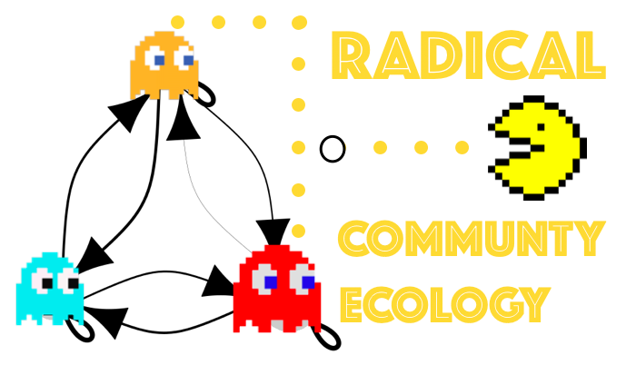

# Read Me

**About Radical Community Ecology:**    

> Community Ecology is a wild space with no clear boundaries. The complexity of how thousands of species sharing space and time interact across multiple trophic levels to attain a relatively stable coexistence over thousand of years is a puzzle worth solving. We want to solve the full puzzle, rather than focussing on a few pieces scattered here and there. Otherwise, is like trying to model the ghost's ecology without modeling Pac-Man. We want to, we try to, but we may fail. Yet this is not a valid reason to stay still. Complex problems require fearless radical approaches. Radical means "forming an inherent or fundamental part of the nature of something" but it also means "representing an extreme or progressive idea". It captures both the solid roots of community ecology with the need to push the boundaries further. Let's unchain the power of community ecology.

Radical Community Ecology is a space created by [Godoy](https://www.oscargodoy.com/) and [Bartomeus](https://bartomeuslab.com/) labs to have fun and share projects.
